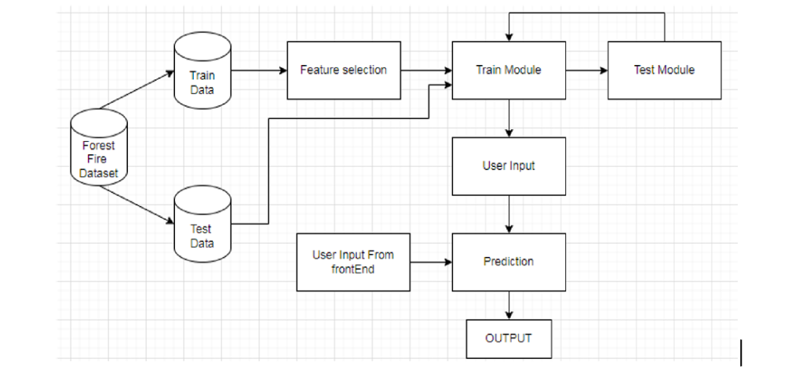
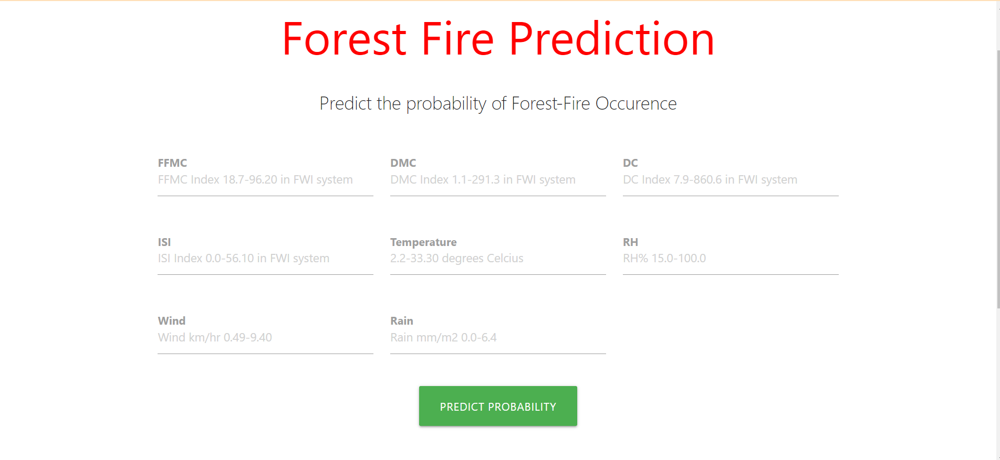

# Forest-Fire-Prediction-System
Forest  fires  have  recently  become  one  of  the  most  regular  natural  disasters,  resulting  in  the  devastation  of  thousands  of  hectares  of  forest.  They  endanger  not  only  forest  resources,  but  also  the  entire  ecosystem,  including  fauna  and  plants,  disrupting  biodiversity,  ecosystems,  and  the  ecology  of  a  region.  It  is  packed  with  dried  senescent  leaven  and  dwelling  that  can  burst  into  flames  triggered  by  a  single  spark  in  the  summer  when  there  has  been  no  rain  for  months. Forecasting forest fires is an essential part of forest fire management.  control. It has a big influence on how resources are allocated. 

# Scope of the project
A  unique  forest  fire  prediction  approach  is  created  using  linear  regression,  random  forest  regression,  logistic  regression,  and  MLP  Classifier.  Weather  parameters are used by the algorithm to predict the severity of the fire hazard.  The  technique  is  used  to  painstakingly  evaluate  the  threat  of  a  forest  fire  incident using data from a dataset.

# Objectives and Problem Statement
Our  Project  aims  to  build  a  forest  fire  prediction  system  which  will  predict  whether  your  forest  is  safe  or  not  by  taking  in  consideration  various  climatic  values .
- To create a machine learning model.
- To predict forest fires.
- To create a user interface for predicting forest fires and display an alert message.

# Group members 
 - [@Vikas Chaurasiya](https://github.com/vikas-348)
 - [@Mukesh Gupta](https://github.com/mukesh2001)
 - [@Ashly Jonh](https://github.com/ADJ46)
 - [@Himanshu Chaurasiya](https://github.com/Himanshuchaurasiya1234)

# Architectural Details 


# System Requirements 
## Hardware requirements 
```
•	Processor: Dual Core or higher

•	Hard Drive: 500 GB or higher

•	RAM: 2GB or higher

•	Internet Connection: Preferred 1Mbps or higher
```
## Software Requirements 
```
•	Front-End Design: HTML, CSS, JavaScript

•	Operating System: Windows 7 or higher

•	Editor Tools: Pycharm/VScode 

•	Web Browser: Google Chrome 
```
# Data Collection 
 [Kaggle Forest Fire Dataset]
(https://www.kaggle.com/datasets/elikplim/forest-fires-data-set)
The  dataset  used  is  a  public  dataset  which  is  available  for  research  purposes.  This  dataset  was  created  by  Paulo  Cortez  and  Aníbal  Morais  (Univ.  Minho)  @2007.  The  forest  fire  dataset  is  a  multivariate  dataset  which  is  a  data  set  consisting  of  two  or  more  than  two  variables  is  referred  to  as  a  multivariate  dataset.  It  has  13  attributes  having  517  instances.  The  total  file  size  f  the  kaggle  Forest Fire dataset is 7KB

## Dataset Preprocessing
Data  preprocessing  is  a  process  of  preparing  the  raw  data  and  making  it  suitable  for  a  machine  learning  model.  It  is  the  first  and  crucial  step  while  creating  a  machine  learning  model.  In  the  Forest  Fire  dataset  there  are  a  total  of  517  instances  with  13  attributes.  All  the  517  instances  are  not  null  instances.  Out  of  the  13  attributes  9  attributes  are  float  data  type,  2  are  of  integer  data  type  and  2  Object data type.

## Prediction Algorithm
In  our  model  we  have  tried  to  use  mainly  two  types  of  predictive  algorithm  regression  and  classification.  Algorithms  which  were  applied  are  linear  regression,  random  Forest  Regressor,  LogisticRegression  and  MLP  classifier.  Depending  on  the  performance  of  the  algorithm  we  have  chosen  the  appropriate  algorithm  which  in  our  case  was  MLP  classifier.  MLPClassifier  stands  for  Multi-layer Perceptron classifier.
 
## Testing and Evaluation
We  have  split  the  train  and  test  model  into  a  ratio  of  60:40  and  then  we  have  applied  the  algorithm.  When  we  applied  the  algorithm  the  r2  score  for  the  regression  task  was  very  low.  The  classification  task  also  showed  a  minimum  accuracy  but  the  accuracy  was  better  with  MLP  classifier.  In  the  web  based  implementation we have used the MLP classifier as the main algorithm. 

# Result 


# Conclusion and Future Scope

Although  the  particular  cause  or  spark  for  a  wildfire  occurrence  cannot  always  be  predicted,  wildfire  risk  can  be  anticipated  to  some  extent  by  understanding  how  climate,  geography,  weather,  and  land  cover  influence  fire  behavior  and  the  likelihood of a fire spreading.

Forest  fires  cause  significant  environmental  damage  while  threatening  human  lives.  A  substantial  effort  was  made  in  the  last  two  decades  to  build  automatic  detection  tools  that  could  assist  Fire  Management  Systems  (FMS).  The  three  major  trends  are  the  use  of  satellite  data,  infrared/smoke  scanners  and  local  sensors (e.g.meteorological).

However,  this  work  opens  room  for  the  development  of  automatic  tools  for  fire  management  support.  Since  the  FMS  system  is  widely  used  around  the  world,  further  research  is  need  to  confirm  if  direct  weather  conditions  are  preferable  than accumulated values  as suggested by this study. 

